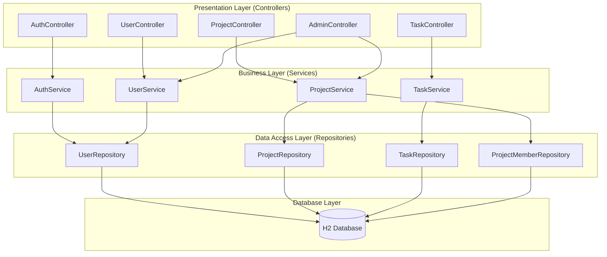
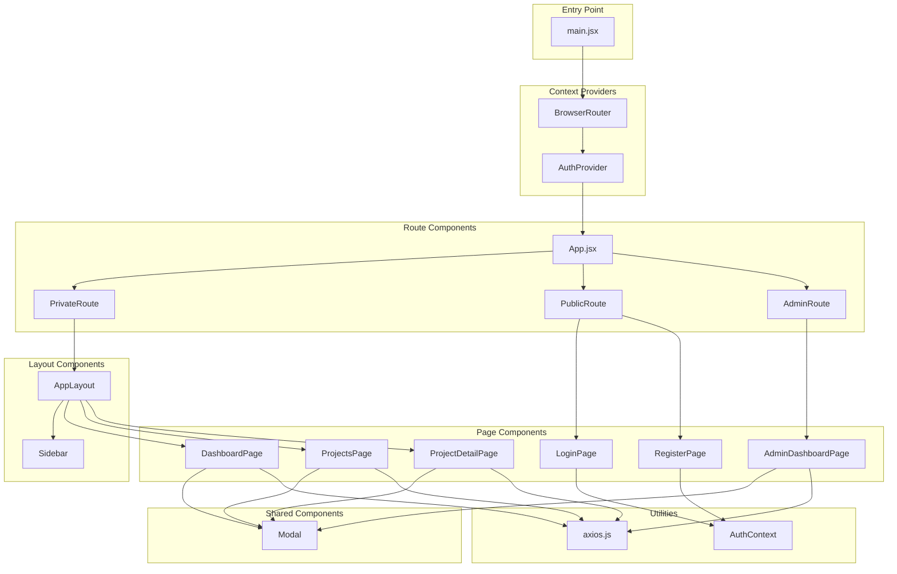
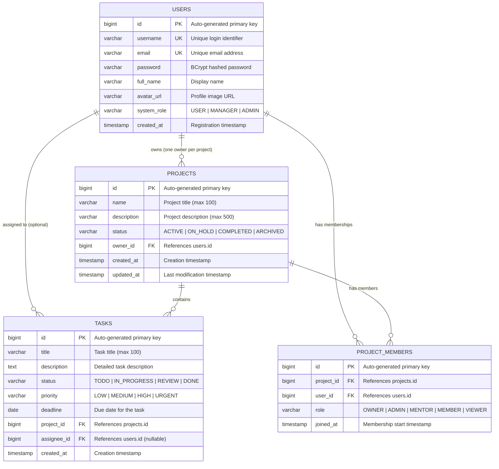
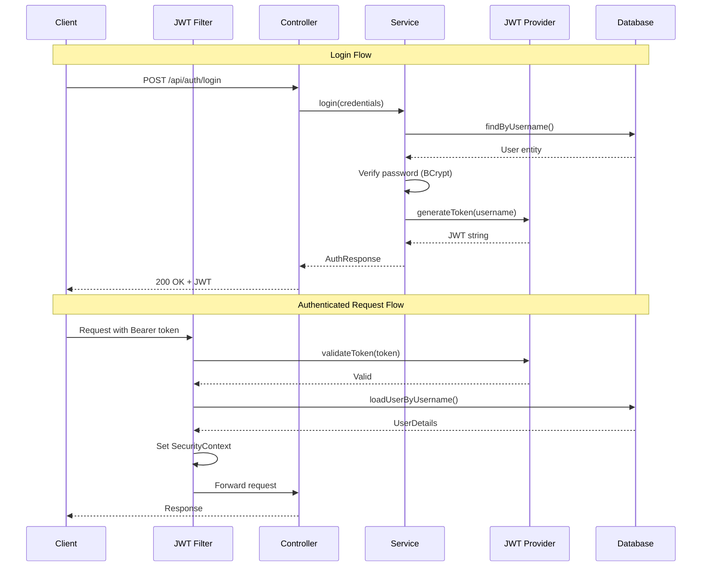
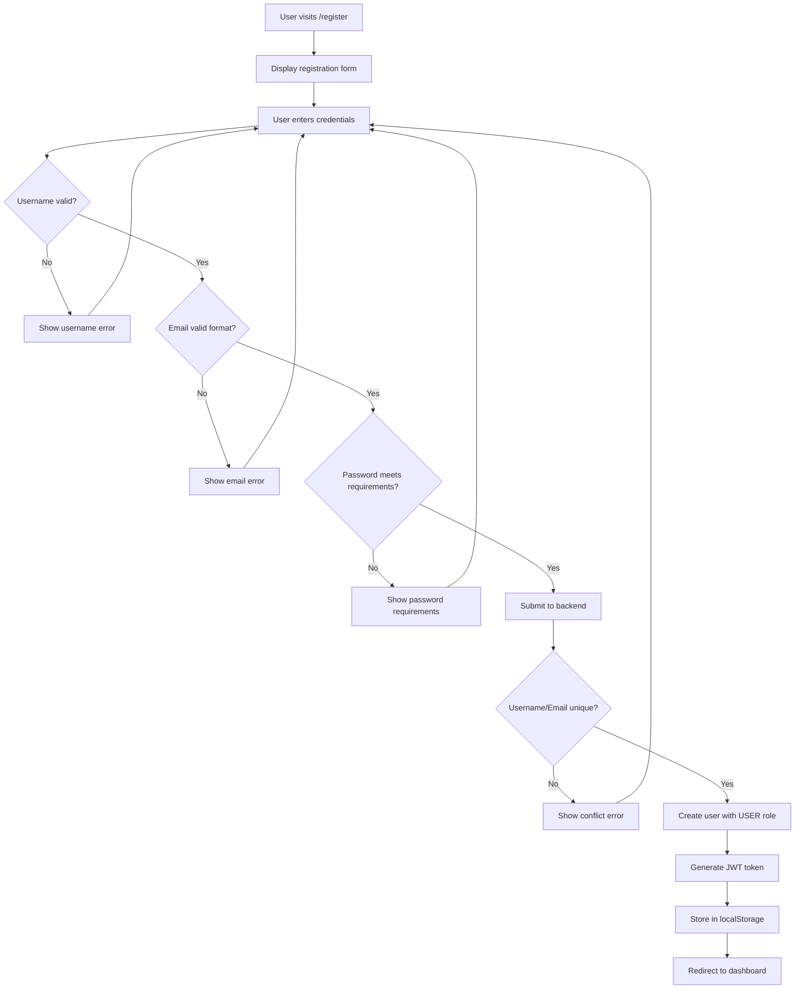
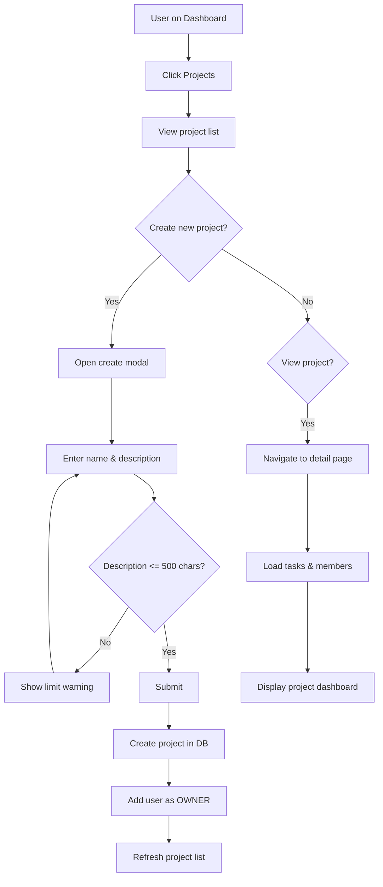
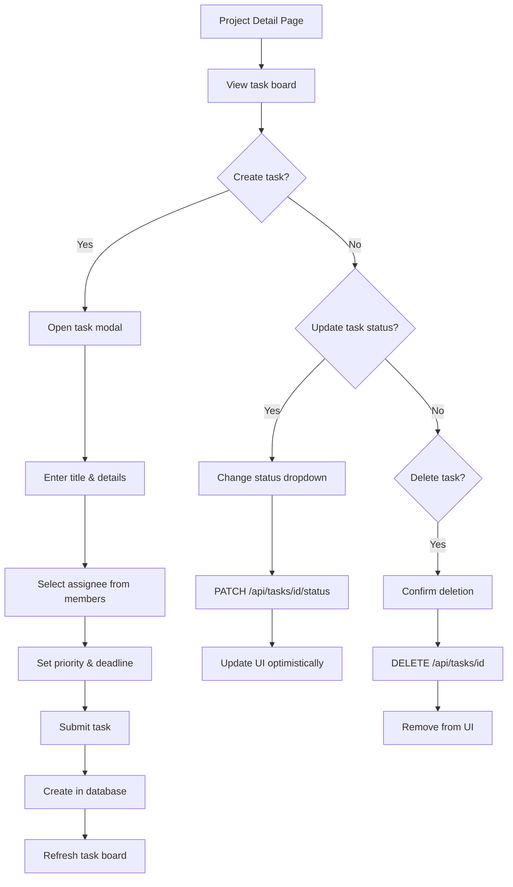

# Project Manager - Enterprise Documentation

## Executive Summary

**Project Manager** is a comprehensive, enterprise-grade full-stack web application designed for team collaboration and project management. Built using modern technologies including Java Spring Boot 3.2 and React 18, this application provides organizations with a robust platform for managing projects, tasks, team members, and workflows.

The application follows industry best practices including clean architecture, separation of concerns, JWT-based authentication, role-based access control (RBAC), and responsive design principles. It is designed to be scalable, maintainable, and secure for production deployments.

---

## Table of Contents

1. [Technology Stack](#technology-stack)
2. [Complete Project Structure](#complete-project-structure)
3. [Backend Architecture](#backend-architecture)
4. [Frontend Architecture](#frontend-architecture)
5. [Database Design](#database-design)
6. [Security Implementation](#security-implementation)
7. [API Documentation](#api-documentation)
8. [Workflow Diagrams](#workflow-diagrams)
9. [Deployment Guide](#deployment-guide)

---

## Technology Stack

### Backend Technologies

#### Java 21 (LTS)
Java 21 is the Long-Term Support release of the Java programming language, chosen as the foundation for this application due to its stability, performance improvements, and enterprise-grade features. Java 21 introduces virtual threads (Project Loom), pattern matching improvements, and enhanced garbage collection. The project leverages Java's strong typing system, object-oriented principles, and robust exception handling to build a reliable backend service. Java's widespread adoption in enterprise environments ensures long-term support, extensive library ecosystem, and availability of skilled developers.

#### Spring Boot 3.2.0
Spring Boot is the premier framework for building Java-based enterprise applications. Version 3.2.0 builds upon the Spring Framework 6.x, providing auto-configuration, embedded server support, and production-ready features out of the box. Spring Boot eliminates boilerplate configuration through convention-over-configuration principles, allowing developers to focus on business logic rather than infrastructure concerns.

Key Spring Boot features utilized in this project:
- **Auto-Configuration**: Automatically configures Spring and third-party libraries based on classpath dependencies
- **Embedded Tomcat**: No need for external application server deployment
- **Spring Boot Starters**: Pre-configured dependency descriptors for common use cases
- **Actuator**: Production-ready monitoring and management endpoints
- **DevTools**: Hot-reload capabilities for development efficiency

#### Spring Security 6.x
Spring Security provides comprehensive authentication and authorization for Java applications. In this project, Spring Security integrates with JWT (JSON Web Tokens) to implement stateless authentication, essential for modern RESTful APIs and microservices architecture.

The security implementation includes:
- **Authentication Manager**: Validates user credentials against the database
- **Password Encoding**: BCrypt hashing for secure password storage
- **Security Filter Chain**: Request filtering and authorization rules
- **CORS Configuration**: Cross-Origin Resource Sharing for frontend communication

#### Spring Data JPA
Spring Data JPA simplifies database access by implementing the repository pattern. It provides automatic query generation from method names, reducing boilerplate code while maintaining type safety. JPA (Java Persistence API) abstracts the underlying database, allowing seamless switching between database vendors.

Features utilized:
- **Repository Interfaces**: CrudRepository and JpaRepository for CRUD operations
- **Query Methods**: Automatic query derivation from method signatures
- **Entity Relationships**: @OneToMany, @ManyToOne, @ManyToMany mappings
- **Cascade Operations**: Automatic persistence of related entities

#### H2 Database
H2 is an in-memory relational database written in Java. For development purposes, H2 provides zero-configuration database access with SQL console support. The application is designed to easily switch to production databases like PostgreSQL or MySQL through configuration changes.

#### Lombok
Project Lombok is a Java library that eliminates boilerplate code through annotations. In this project, Lombok generates getters, setters, constructors, equals/hashCode methods, and builder patterns at compile time, significantly reducing code verbosity while maintaining full functionality.

Annotations used:
- `@Data`: Generates getters, setters, toString, equals, and hashCode
- `@NoArgsConstructor`: Generates no-argument constructor
- `@AllArgsConstructor`: Generates all-argument constructor
- `@Builder`: Implements the builder pattern

#### JWT (JSON Web Tokens)
JWT provides stateless authentication, essential for scalable applications. Tokens are self-contained, containing user information and expiration, eliminating the need for server-side session storage. The implementation uses the JJWT library for token generation and validation.

### Frontend Technologies

#### React 18
React is Facebook's JavaScript library for building user interfaces. Version 18 introduces concurrent rendering, automatic batching, and improved Suspense support. React's component-based architecture promotes code reusability, maintainability, and testability.

Key React 18 features utilized:
- **Functional Components**: Modern stateless component pattern
- **Hooks**: useState, useEffect, useMemo, useContext for state management
- **Context API**: Global state management without external libraries
- **Concurrent Rendering**: Improved performance for complex UIs

#### React Router DOM
React Router provides declarative routing for React applications. It enables single-page application (SPA) navigation without full page reloads, maintaining application state across route changes.

Features implemented:
- **BrowserRouter**: HTML5 history API for clean URLs
- **Protected Routes**: Authentication-based route guards
- **Dynamic Routes**: Parameter-based routing for resource pages
- **Navigation**: Programmatic and declarative navigation

#### Axios
Axios is a promise-based HTTP client for JavaScript. It provides interceptors for request/response transformation, automatic JSON parsing, and error handling. The project implements request interceptors for JWT token injection and response interceptors for authentication error handling.

#### Vite
Vite is a next-generation frontend build tool providing instant server start, lightning-fast Hot Module Replacement (HMR), and optimized production builds. Compared to traditional bundlers like Webpack, Vite leverages native ES modules for significantly faster development experience.

#### CSS3
The application uses vanilla CSS3 with custom properties (CSS variables) for theming. This approach provides maximum flexibility, performance, and browser compatibility without external CSS framework dependencies.

CSS features utilized:
- **Custom Properties**: Theming and design tokens
- **Flexbox**: One-dimensional layouts
- **CSS Grid**: Two-dimensional layouts
- **Transitions**: Smooth animations
- **Media Queries**: Responsive design
- **Backdrop Filter**: Glassmorphism effects

---

## Complete Project Structure

```
Full Stack development_Project Management Using JAVA + React/
│
├── backend/                          # Spring Boot Backend Application
│   ├── .mvn/                         # Maven Wrapper configuration
│   │   └── wrapper/
│   │       └── maven-wrapper.properties
│   │
│   ├── src/
│   │   ├── main/
│   │   │   ├── java/com/projectmanager/
│   │   │   │   │
│   │   │   │   ├── ProjectManagerApplication.java
│   │   │   │   │   # Main entry point for Spring Boot
│   │   │   │   │   # Contains @SpringBootApplication annotation
│   │   │   │   │   # Bootstraps the application context
│   │   │   │   │
│   │   │   │   ├── controller/       # REST API Controllers
│   │   │   │   │   ├── AuthController.java
│   │   │   │   │   │   # Handles /api/auth/* endpoints
│   │   │   │   │   │   # Login and registration endpoints
│   │   │   │   │   │   # Returns JWT tokens on success
│   │   │   │   │   │
│   │   │   │   │   ├── ProjectController.java
│   │   │   │   │   │   # Handles /api/projects/* endpoints
│   │   │   │   │   │   # CRUD operations for projects
│   │   │   │   │   │   # Member management endpoints
│   │   │   │   │   │
│   │   │   │   │   ├── TaskController.java
│   │   │   │   │   │   # Handles /api/tasks/* endpoints
│   │   │   │   │   │   # Task CRUD and status updates
│   │   │   │   │   │   # Task assignment functionality
│   │   │   │   │   │
│   │   │   │   │   ├── UserController.java
│   │   │   │   │   │   # Handles /api/users/* endpoints
│   │   │   │   │   │   # User profile and search
│   │   │   │   │   │   # Current user information
│   │   │   │   │   │
│   │   │   │   │   └── AdminController.java
│   │   │   │   │       # Handles /api/admin/* endpoints
│   │   │   │   │       # User management for admins
│   │   │   │   │       # Bulk project assignment
│   │   │   │   │
│   │   │   │   ├── dto/              # Data Transfer Objects
│   │   │   │   │   ├── LoginRequest.java
│   │   │   │   │   │   # Username and password for login
│   │   │   │   │   │
│   │   │   │   │   ├── RegisterRequest.java
│   │   │   │   │   │   # Registration form data
│   │   │   │   │   │
│   │   │   │   │   ├── AuthResponse.java
│   │   │   │   │   │   # JWT token and user info response
│   │   │   │   │   │
│   │   │   │   │   ├── ProjectRequest.java
│   │   │   │   │   │   # Project creation/update data
│   │   │   │   │   │
│   │   │   │   │   ├── ProjectResponse.java
│   │   │   │   │   │   # Project with computed fields
│   │   │   │   │   │
│   │   │   │   │   ├── TaskRequest.java
│   │   │   │   │   │   # Task creation/update data
│   │   │   │   │   │
│   │   │   │   │   ├── TaskResponse.java
│   │   │   │   │   │   # Task with project name
│   │   │   │   │   │
│   │   │   │   │   ├── MemberRequest.java
│   │   │   │   │   │   # Add member with role
│   │   │   │   │   │
│   │   │   │   │   ├── AdminUserResponse.java
│   │   │   │   │   │   # User info for admin view
│   │   │   │   │   │
│   │   │   │   │   ├── AdminUserUpdateRequest.java
│   │   │   │   │   │   # Update user credentials
│   │   │   │   │   │
│   │   │   │   │   ├── RoleUpdateRequest.java
│   │   │   │   │   │   # Change user system role
│   │   │   │   │   │
│   │   │   │   │   └── ProjectAssignmentRequest.java
│   │   │   │   │       # Bulk user assignment
│   │   │   │   │
│   │   │   │   ├── model/            # JPA Entity Classes
│   │   │   │   │   ├── User.java
│   │   │   │   │   │   # User entity with SystemRole enum
│   │   │   │   │   │   # Fields: id, username, email, password,
│   │   │   │   │   │   #         fullName, systemRole, createdAt
│   │   │   │   │   │   # Relations: ownedProjects, assignedTasks,
│   │   │   │   │   │   #            projectMemberships
│   │   │   │   │   │
│   │   │   │   │   ├── Project.java
│   │   │   │   │   │   # Project entity with Status enum
│   │   │   │   │   │   # Fields: id, name, description, status,
│   │   │   │   │   │   #         owner, createdAt, updatedAt
│   │   │   │   │   │   # Relations: tasks, members
│   │   │   │   │   │
│   │   │   │   │   ├── Task.java
│   │   │   │   │   │   # Task entity with Status/Priority enums
│   │   │   │   │   │   # Fields: id, title, description, status,
│   │   │   │   │   │   #         priority, deadline, project, assignee
│   │   │   │   │   │
│   │   │   │   │   └── ProjectMember.java
│   │   │   │   │       # Many-to-many with role (MemberRole enum)
│   │   │   │   │       # Roles: OWNER, ADMIN, MENTOR, MEMBER, VIEWER
│   │   │   │   │
│   │   │   │   ├── repository/       # Spring Data Repositories
│   │   │   │   │   ├── UserRepository.java
│   │   │   │   │   │   # findByUsername, findByEmail
│   │   │   │   │   │   # existsByUsername, existsByEmail
│   │   │   │   │   │
│   │   │   │   │   ├── ProjectRepository.java
│   │   │   │   │   │   # findByOwnerId, findByMembersUserId
│   │   │   │   │   │
│   │   │   │   │   ├── TaskRepository.java
│   │   │   │   │   │   # findByProjectId, findByAssigneeId
│   │   │   │   │   │   # findOverdueTasks
│   │   │   │   │   │
│   │   │   │   │   └── ProjectMemberRepository.java
│   │   │   │   │       # findByProjectId, findByUserId
│   │   │   │   │
│   │   │   │   ├── service/          # Business Logic Layer
│   │   │   │   │   ├── AuthService.java
│   │   │   │   │   │   # login(): Authenticate and return JWT
│   │   │   │   │   │   # register(): Create user and return JWT
│   │   │   │   │   │
│   │   │   │   │   ├── ProjectService.java
│   │   │   │   │   │   # CRUD operations with authorization
│   │   │   │   │   │   # Member management
│   │   │   │   │   │   # Task count calculations
│   │   │   │   │   │
│   │   │   │   │   ├── TaskService.java
│   │   │   │   │   │   # Task CRUD with project validation
│   │   │   │   │   │   # Status transitions
│   │   │   │   │   │   # Assignment logic
│   │   │   │   │   │
│   │   │   │   │   └── UserService.java
│   │   │   │   │       # User lookup and search
│   │   │   │   │       # Profile management
│   │   │   │   │
│   │   │   │   └── security/         # Security Configuration
│   │   │   │       ├── SecurityConfig.java
│   │   │   │       │   # SecurityFilterChain bean
│   │   │   │       │   # CORS configuration
│   │   │   │       │   # Public vs protected endpoints
│   │   │   │       │
│   │   │   │       ├── JwtTokenProvider.java
│   │   │   │       │   # generateToken(): Create JWT
│   │   │   │       │   # validateToken(): Verify signature
│   │   │   │       │   # getUsernameFromToken(): Extract claims
│   │   │   │       │
│   │   │   │       ├── JwtAuthenticationFilter.java
│   │   │   │       │   # OncePerRequestFilter implementation
│   │   │   │       │   # Extracts token from Authorization header
│   │   │   │       │   # Sets SecurityContext on valid token
│   │   │   │       │
│   │   │   │       └── CustomUserDetailsService.java
│   │   │   │           # Loads user from database
│   │   │   │           # Implements UserDetailsService
│   │   │   │
│   │   │   └── resources/
│   │   │       └── application.properties
│   │   │           # Server port configuration
│   │   │           # Database connection settings
│   │   │           # JPA/Hibernate settings
│   │   │           # JWT secret and expiration
│   │   │           # CORS allowed origins
│   │   │           # H2 console configuration
│   │   │
│   │   └── test/                     # Test directory (standard)
│   │
│   ├── mvnw                          # Maven Wrapper (Unix)
│   ├── mvnw.cmd                      # Maven Wrapper (Windows)
│   └── pom.xml                       # Maven Project Configuration
│       # Dependencies: spring-boot-starter-web,
│       #   spring-boot-starter-security,
│       #   spring-boot-starter-data-jpa,
│       #   h2database, lombok, jjwt
│
├── frontend/                         # React Frontend Application
│   ├── public/                       # Static assets
│   │
│   ├── src/
│   │   ├── api/
│   │   │   └── axios.js
│   │   │       # Axios instance with baseURL
│   │   │       # Request interceptor: JWT injection
│   │   │       # Response interceptor: 401 handling
│   │   │       # API objects: authAPI, userAPI, projectAPI,
│   │   │       #              taskAPI, adminAPI
│   │   │
│   │   ├── components/
│   │   │   └── common/
│   │   │       ├── Sidebar.jsx
│   │   │       │   # Navigation sidebar component
│   │   │       │   # Links: Dashboard, Projects, Admin
│   │   │       │   # User info and logout button
│   │   │       │   # Conditional Admin link for admin/manager
│   │   │       │
│   │   │       ├── Sidebar.css
│   │   │       │   # Sidebar styling with gradients
│   │   │       │   # Navigation item states
│   │   │       │
│   │   │       └── Modal.jsx
│   │   │           # Reusable modal component
│   │   │           # Props: isOpen, onClose, title, children
│   │   │
│   │   ├── context/
│   │   │   └── AuthContext.jsx
│   │   │       # React Context for authentication
│   │   │       # State: user, loading
│   │   │       # Functions: login, register, logout
│   │   │       # Persists token/user in localStorage
│   │   │       # Auto-validates token on app load
│   │   │
│   │   ├── pages/
│   │   │   ├── LoginPage.jsx
│   │   │   │   # Login form with validation
│   │   │   │   # Time-based greeting (Good Morning/etc)
│   │   │   │   # Error handling and loading state
│   │   │   │
│   │   │   ├── RegisterPage.jsx
│   │   │   │   # Registration form with validation
│   │   │   │   # Password strength indicator
│   │   │   │   # 5-point password requirements
│   │   │   │   # Email format validation
│   │   │   │   # Time-based welcome greeting
│   │   │   │
│   │   │   ├── AuthPages.css
│   │   │   │   # Auth page styling
│   │   │   │   # Centered card layout
│   │   │   │   # Form input styles
│   │   │   │
│   │   │   ├── DashboardPage.jsx
│   │   │   │   # Main dashboard after login
│   │   │   │   # Stats cards: projects, tasks, completed
│   │   │   │   # Recent projects list
│   │   │   │   # My tasks list
│   │   │   │   # Admin quick actions panel
│   │   │   │   # Quick team assignment modal
│   │   │   │
│   │   │   ├── DashboardPage.css
│   │   │   │   # Dashboard grid layout
│   │   │   │   # Stats card styling
│   │   │   │   # Admin actions styling
│   │   │   │
│   │   │   ├── ProjectsPage.jsx
│   │   │   │   # Projects listing with cards
│   │   │   │   # Create project modal
│   │   │   │   # Character counter (0/500)
│   │   │   │   # Project status badges
│   │   │   │
│   │   │   ├── ProjectsPage.css
│   │   │   │   # Project cards grid
│   │   │   │   # Modal styling
│   │   │   │
│   │   │   ├── ProjectDetailPage.jsx
│   │   │   │   # Single project view
│   │   │   │   # Task board with columns
│   │   │   │   # Member list with roles
│   │   │   │   # Progress bar
│   │   │   │   # Add task/member modals
│   │   │   │
│   │   │   ├── ProjectDetailPage.css
│   │   │   │   # Task board styling
│   │   │   │   # Member list styling
│   │   │   │
│   │   │   ├── AdminDashboardPage.jsx
│   │   │   │   # Admin-only page
│   │   │   │   # User management table
│   │   │   │   # Edit user credentials modal
│   │   │   │   # Change system role
│   │   │   │   # Project overview with progress
│   │   │   │   # Bulk user assignment
│   │   │   │
│   │   │   └── AdminDashboardPage.css
│   │   │       # Admin table styling
│   │   │       # Role badges
│   │   │       # User selection list
│   │   │
│   │   ├── App.jsx
│   │   │   # Root component with routing
│   │   │   # Route definitions
│   │   │   # PrivateRoute: Auth required
│   │   │   # PublicRoute: Redirect if authed
│   │   │   # AdminRoute: Admin/Manager only
│   │   │   # AppLayout: Sidebar wrapper
│   │   │
│   │   ├── index.css
│   │   │   # Global styles and CSS variables
│   │   │   # Design tokens (colors, spacing, etc)
│   │   │   # Utility classes
│   │   │   # Component base styles
│   │   │   # Responsive breakpoints
│   │   │
│   │   └── main.jsx
│   │       # React entry point
│   │       # BrowserRouter wrapper
│   │       # AuthProvider wrapper
│   │
│   ├── index.html                    # HTML entry point
│   ├── package.json                  # NPM dependencies
│   ├── vite.config.js                # Vite configuration
│   └── eslint.config.js              # ESLint rules
│
├── README.md                         # Project overview and setup
└── DOCUMENTATION.md                  # This detailed documentation
```

---

## Backend Architecture

### Layered Architecture Pattern

The backend follows the classic three-tier architecture pattern, ensuring separation of concerns and maintainability:



### Controller Layer

Controllers are responsible for handling HTTP requests, validating input, and returning appropriate responses. Each controller is annotated with `@RestController` and mapped to a specific URL path using `@RequestMapping`.

**AuthController** handles authentication endpoints. The `/api/auth/login` endpoint accepts username and password, delegates to AuthService for validation, and returns a JWT token on success. The `/api/auth/register` endpoint creates new users with validation and returns an authentication token for immediate login.

**ProjectController** manages project lifecycle. It provides CRUD endpoints for projects, with authorization checks ensuring users can only modify their own projects or projects where they have appropriate member roles. The controller also handles member management through dedicated endpoints.

**TaskController** handles task operations within projects. It validates project membership before allowing task operations and manages task assignment to team members.

**AdminController** provides administrative functionality restricted to users with ADMIN or MANAGER system roles. It enables user management, role changes, and bulk project assignments.

### Service Layer

Services contain the business logic of the application. They are annotated with `@Service` and injected into controllers using dependency injection.

**AuthService** handles authentication logic. For login, it uses Spring Security's AuthenticationManager to validate credentials, then generates a JWT token using JwtTokenProvider. For registration, it validates uniqueness constraints, encodes the password using BCrypt, saves the user, and generates a token.

**ProjectService** manages project operations with authorization. It calculates derived fields like task counts and completed task counts. When creating a project, it automatically adds the creator as an OWNER member.

**TaskService** handles task CRUD with project validation. It ensures tasks belong to valid projects and assignees are project members.

### Repository Layer

Repositories extend Spring Data JPA interfaces, providing automatic implementation of common database operations plus custom query methods.

```java
// Example: UserRepository
public interface UserRepository extends JpaRepository<User, Long> {
    Optional<User> findByUsername(String username);
    Optional<User> findByEmail(String email);
    Boolean existsByUsername(String username);
    Boolean existsByEmail(String email);
    List<User> findByUsernameContainingIgnoreCase(String username);
}
```

---

## Frontend Architecture

### Component Architecture

The frontend follows a component-based architecture with clear separation between pages, components, and utilities:



### State Management

The application uses React Context for global authentication state and local component state for UI:

**AuthContext** provides:
- `user`: Current authenticated user object with id, username, email, fullName, systemRole
- `loading`: Boolean indicating authentication check in progress
- `isAuthenticated`: Derived boolean from user presence
- `login(username, password)`: Authenticates and stores credentials
- `register(userData)`: Creates account and authenticates
- `logout()`: Clears stored credentials

**Local Component State** manages:
- Form data and validation states
- Loading indicators for async operations
- Modal open/close states
- Selected items for operations

### API Integration

The axios.js file creates a configured Axios instance with interceptors:

```javascript
// Request Interceptor
api.interceptors.request.use(config => {
    const token = localStorage.getItem('token');
    if (token) {
        config.headers.Authorization = `Bearer ${token}`;
    }
    return config;
});

// Response Interceptor
api.interceptors.response.use(
    response => response,
    error => {
        if (error.response?.status === 401) {
            localStorage.removeItem('token');
            window.location.href = '/login';
        }
        return Promise.reject(error);
    }
);
```

---

## Database Design

### Entity Relationship Diagram



### Enum Definitions

**User.SystemRole**
| Value | Description |
|-------|-------------|
| USER | Default role for all registered users. Can create and manage own projects. |
| MANAGER | Can access admin dashboard and assign users to any project. |
| ADMIN | Full system access including user management and role changes. |

**Project.Status**
| Value | Description |
|-------|-------------|
| ACTIVE | Project is currently being worked on. |
| ON_HOLD | Project is temporarily paused. |
| COMPLETED | Project has been finished. |
| ARCHIVED | Project is closed and archived. |

**Task.Status**
| Value | Description |
|-------|-------------|
| TODO | Task is pending start. |
| IN_PROGRESS | Task is actively being worked on. |
| REVIEW | Task is complete and awaiting review. |
| DONE | Task is fully completed. |

**Task.Priority**
| Value | Description |
|-------|-------------|
| LOW | Non-urgent task. |
| MEDIUM | Standard priority. |
| HIGH | Important task requiring attention. |
| URGENT | Critical task requiring immediate action. |

**ProjectMember.MemberRole**
| Value | Description |
|-------|-------------|
| OWNER | Project creator with full control. |
| ADMIN | Can manage project settings and members. |
| MENTOR | Can guide team members and review work. |
| MEMBER | Standard team member who can work on tasks. |
| VIEWER | Read-only access to project. |

---

## Security Implementation

### Authentication Flow



### Password Security

Passwords are hashed using BCrypt with a work factor of 10, providing:
- One-way hashing (cannot be reversed)
- Salt included in hash (prevents rainbow table attacks)
- Adjustable work factor (can increase as hardware improves)

### JWT Token Security

JWT tokens include:
- Subject (username)
- Issued At timestamp
- Expiration timestamp (24 hours)
- HMAC-SHA256 signature using secret key

---

## API Documentation

### Complete Endpoint Reference

#### Authentication Endpoints

| Method | Endpoint | Request Body | Response | Description |
|--------|----------|--------------|----------|-------------|
| POST | /api/auth/login | `{username, password}` | `{token, type, id, username, email, fullName, systemRole}` | Authenticate user |
| POST | /api/auth/register | `{username, email, password, fullName}` | `{token, type, id, username, email, fullName, systemRole}` | Create new user |

#### User Endpoints

| Method | Endpoint | Auth | Response | Description |
|--------|----------|------|----------|-------------|
| GET | /api/users/me | Required | User object | Get current user profile |
| GET | /api/users/search?query=x | Required | User[] | Search users by username |

#### Project Endpoints

| Method | Endpoint | Auth | Request Body | Response | Description |
|--------|----------|------|--------------|----------|-------------|
| GET | /api/projects | Required | - | Project[] | Get all user's projects |
| POST | /api/projects | Required | `{name, description, status}` | Project | Create new project |
| GET | /api/projects/{id} | Required | - | Project | Get project by ID |
| PUT | /api/projects/{id} | Required | `{name, description, status}` | Project | Update project |
| DELETE | /api/projects/{id} | Required | - | - | Delete project |
| GET | /api/projects/{id}/members | Required | - | Member[] | Get project members |
| POST | /api/projects/{id}/members | Required | `{userId, role}` | Member | Add member to project |
| DELETE | /api/projects/{id}/members/{userId} | Required | - | - | Remove member |

#### Task Endpoints

| Method | Endpoint | Auth | Request Body | Response | Description |
|--------|----------|------|--------------|----------|-------------|
| GET | /api/tasks/project/{id} | Required | - | Task[] | Get tasks by project |
| GET | /api/tasks/my-tasks | Required | - | Task[] | Get assigned tasks |
| GET | /api/tasks/{id} | Required | - | Task | Get task by ID |
| POST | /api/tasks | Required | `{title, description, projectId, assigneeId, priority, deadline}` | Task | Create task |
| PUT | /api/tasks/{id} | Required | Task fields | Task | Update task |
| PATCH | /api/tasks/{id}/status | Required | `{status}` | Task | Update task status |
| DELETE | /api/tasks/{id} | Required | - | - | Delete task |

#### Admin Endpoints

| Method | Endpoint | Auth | Request Body | Response | Description |
|--------|----------|------|--------------|----------|-------------|
| GET | /api/admin/users | Admin | - | AdminUser[] | Get all users |
| GET | /api/admin/users/{id} | Admin | - | AdminUser | Get user by ID |
| PUT | /api/admin/users/{id} | Admin | `{username, email, fullName, password}` | AdminUser | Update user |
| PUT | /api/admin/users/{id}/role | Admin | `{role}` | AdminUser | Change system role |
| GET | /api/admin/projects | Admin | - | Project[] | Get all projects |
| POST | /api/admin/projects/{id}/assign | Admin | `{userIds[], role}` | - | Bulk assign users |

---

## Workflow Diagrams

### User Registration Workflow



### Project Management Workflow



### Task Management Workflow



---

## Deployment Guide

### Development Environment

**Backend:**
```bash
cd backend
./mvnw spring-boot:run
# Runs on http://localhost:8080
```

**Frontend:**
```bash
cd frontend
npm install
npm run dev
# Runs on http://localhost:5173
```

### Production Build

**Backend:**
```bash
cd backend
./mvnw clean package -DskipTests
java -jar target/project-manager-1.0.0.jar
```

**Frontend:**
```bash
cd frontend
npm run build
# Deploy dist/ folder to CDN or static server
```

### Environment Variables

| Variable | Description | Default | Required |
|----------|-------------|---------|----------|
| PORT | Backend server port | 8080 | No |
| DATABASE_URL | JDBC connection string | H2 in-memory | No |
| DB_USER | Database username | sa | No |
| DB_PASSWORD | Database password | (empty) | No |
| JWT_SECRET | Token signing key | Generated | Production: Yes |
| CORS_ORIGINS | Allowed frontend origins | localhost | Production: Yes |

---

## Conclusion

This documentation provides a comprehensive overview of the Project Manager application architecture, implementation details, and operational guidelines. The application is designed following enterprise best practices, ensuring scalability, maintainability, and security for production deployments.

For questions or contributions, please refer to the project repository.
