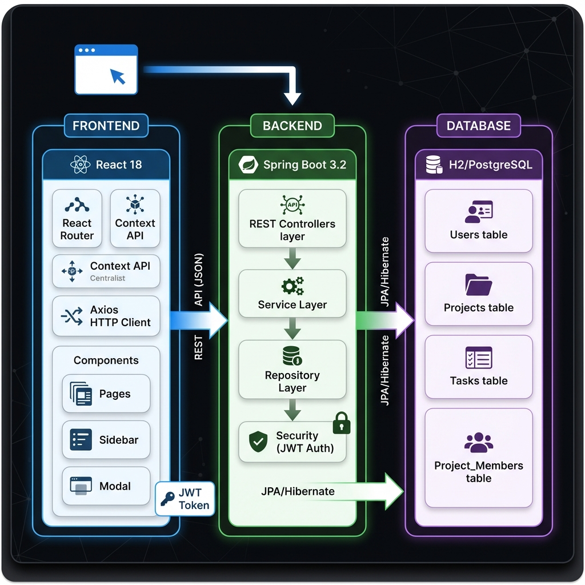
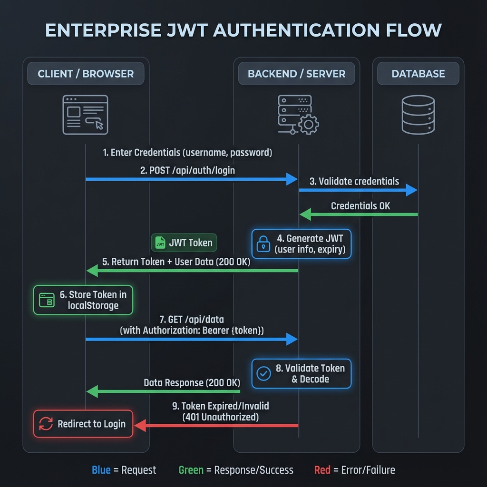
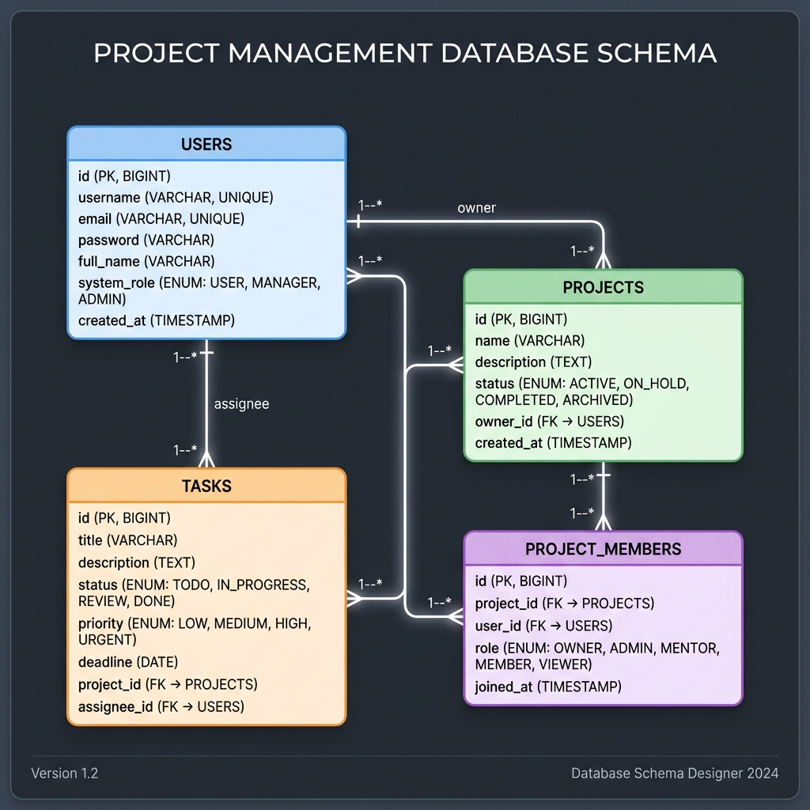
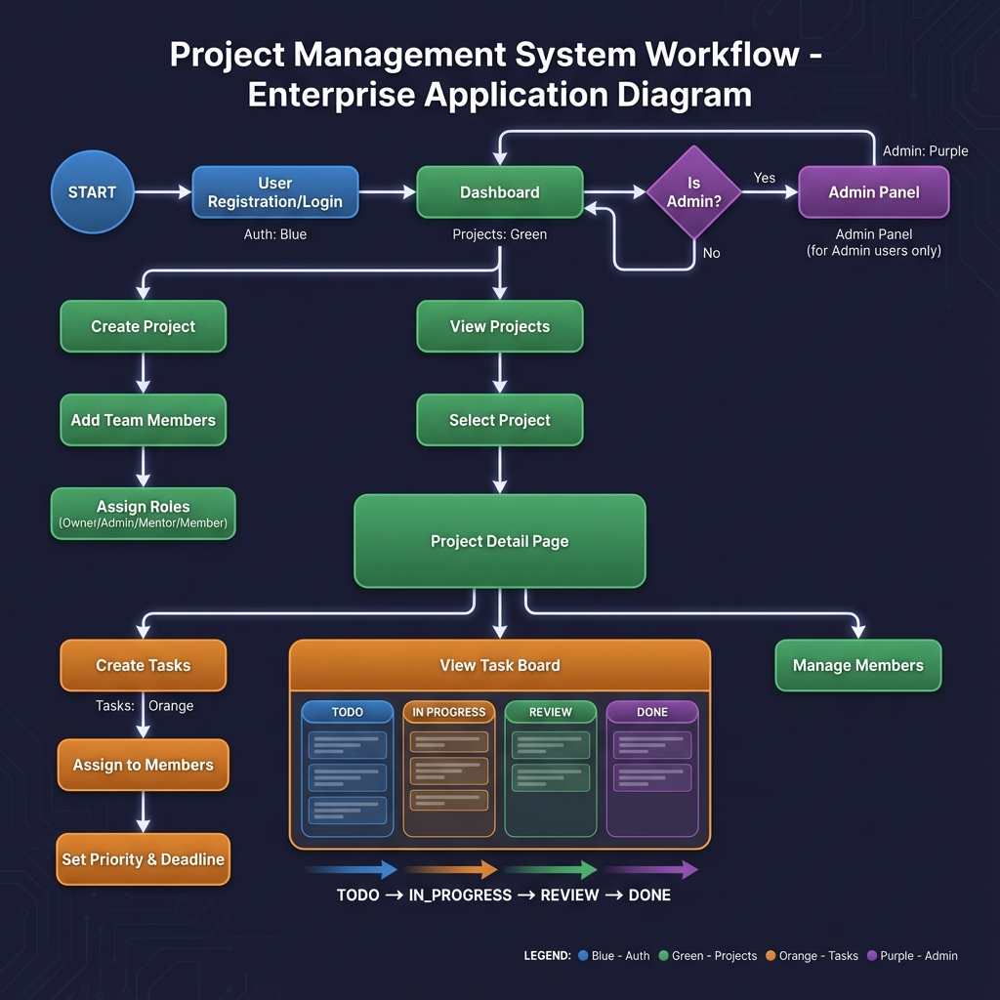

# PROJECT MANAGER – FULL STACK WEB APPLICATION

## A PROJECT REPORT

Submitted by

**22781A05XX: RITIKESH SHARMA**

in partial fulfilment of the award of the degree of

**BACHELOR OF TECHNOLOGY**

in

**COMPUTER SCIENCE AND ENGINEERING**

Under the Guidance of

**[Guide Name], [Qualification]**

Assistant Professor, CSE Department

---

**SRI VENKATESWARA COLLEGE OF ENGINEERING & TECHNOLOGY**

(Autonomous)

R.V.S NAGAR, CHITTOOR – 517127 (A.P)

(Approved by AICTE, New Delhi, Affiliated to JNTUA, Ananthapuram)

(Accredited by NBA, New Delhi, NAAC 'A+', Bengaluru)

(An ISO 9001:2000 Certified Institution)

**MAY 2026**

---

## SRI VENKATESWARA COLLEGE OF ENGINEERING & TECHNOLOGY (AUTONOMOUS)

R.V.S NAGAR, CHITTOOR – 517127 (A.P)

(APPROVED BY AICTE, NEW DELHI, AFFILIATED TO JNTUA, ANANTHAPURAM)

(ACCREDITED BY NBA, NEW DELHI, NAAC 'A+', BENGALURU)

(AN ISO 9001:2000 CERTIFIED INSTITUTION)

### DEPARTMENT OF COMPUTER SCIENCE AND ENGINEERING

### BONAFIDE CERTIFICATE

This is to certify that, the project entitled **"Project Manager – Full Stack Web Application Using Java Spring Boot and React"** is a bonafide work carried by **Ritikesh Sharma (22781A05XX)**, student of the Department of Computer Science and Engineering, Sri Venkateswara College of Engineering and Technology (Autonomous), Chittoor, during the academic year 2025–2026.

| | |
|---|---|
| **[Guide Name], [Qualification]** | **Dr. P. JYOTHEESWARI M.Tech, Ph.D** |
| Assistant Professor | Head of Department |
| Department of CSE | Department of CSE |

&nbsp;

**INTERNAL EXAMINER &emsp;&emsp;&emsp;&emsp;&emsp;&emsp;&emsp; EXTERNAL EXAMINER**

Viva voice conducted on: ___________________

---

## SRI VENKATESWARA COLLEGE OF ENGINEERING & TECHNOLOGY (AUTONOMOUS)

R.V.S NAGAR, CHITTOOR – 517127 (A.P)

### DEPARTMENT OF COMPUTER SCIENCE AND ENGINEERING

### DECLARATION

I, **Ritikesh Sharma (22781A05XX)**, hereby declare that the project report entitled **"Project Manager – Full Stack Web Application Using Java Spring Boot and React"**, under the guidance of **[Guide Name]**, Assistant Professor, Department of Computer Science and Engineering, Sri Venkateswara College of Engineering and Technology (Autonomous), Chittoor, is submitted in partial fulfilment of the requirements for the award of the degree of **Bachelor of Technology** in **Computer Science and Engineering** during the academic year 2025–2026.

This report is a record of the bonafide work carried out by me. The results embodied in this project report have not been reproduced or copied from any source. The results presented in this report have not been submitted to any other university or institute for the award of any other degree or diploma.

&nbsp;

**22781A05XX: RITIKESH SHARMA**

---

### ACKNOWLEDGEMENT

A grateful thanks to **Dr. R. VENKATASWAMY**, Chairman of Sri Venkateswara College of Engineering and Technology for providing education in their esteemed institution.

I wish to record my deep sense of gratitude and profound thanks to our beloved Vice Chairman, **Sri R. V. SRINIVAS** for his valuable support throughout the course.

I express my sincere thanks to **Dr. M. MOHAN BABU**, our beloved Principal for his encouragement and suggestion during the course of study.

With the deep sense of gratefulness, I acknowledge **Dr. P. JYOTHEESWARI**, Head of the Department of Computer Science and Engineering, for giving us her inspiring guidance in undertaking our project report.

I express my sincere thanks to the Project Guide **[Guide Name]**, Assistant Professor, Department of Computer Science and Engineering, for his keen interest, stimulating guidance, constant encouragement with our work during all stages, to bring this project into fruition.

I wish to convey my gratitude and express my sincere thanks to all Project Review Committee members for their support and cooperation rendered for successful submission of our project work.

Finally, I would like to express my sincere thanks to all teaching, non-teaching faculty members, my parents, friends and for all those who have supported me to complete the project work successfully.

&nbsp;

**22781A05XX: RITIKESH SHARMA**

---

### ABSTRACT

The rapid growth of digital workplaces and distributed teams has significantly increased the demand for efficient, web-based project management solutions that enable real-time collaboration, task tracking, and workflow coordination. Traditional methods of managing projects such as spreadsheets, email-based communication, and standalone desktop tools often fail to provide the level of integration, accessibility, and scalability required by modern development teams. These approaches frequently result in misaligned priorities, unclear task ownership, missed deadlines, and overall reduced productivity across teams. Therefore, developing a robust and centralized project management platform has become an essential endeavor for organizations seeking streamlined collaboration and improved operational efficiency.

Existing commercial project management tools available in the market, while feature-rich, often impose high licensing costs, steep learning curves, and limited customization flexibility. Many of these platforms lack the ability to seamlessly integrate secure user authentication, granular role-based access control, and intuitive task lifecycle management within a unified system. To overcome these shortcomings, this project presents the design and development of a comprehensive full-stack Project Management Application built using modern web technologies, specifically Java Spring Boot for the backend services and React for the frontend user interface.

The backend system is developed using the Spring Boot framework following a layered architecture pattern that separates concerns across Controller, Service, and Repository layers. Spring Data JPA is employed to handle database operations through an H2 relational database, managing core entities including Users, Projects, Tasks, and Project Members with well-defined relationships and cascading operations. Security is enforced through stateless JWT-based authentication integrated with Spring Security, where each API request is verified and authorized using token-based validation. The system implements a multi-tier role-based access control mechanism distinguishing between User, Manager, and Admin system roles, along with granular project-level roles such as Owner, Admin, Mentor, Member, and Viewer, enabling fine-grained permission management.

The frontend application is built using React 18 with a component-based architecture, utilizing React Context API for centralized authentication state management and Axios with request and response interceptors for seamless API communication. The user interface features a dynamic Dashboard with real-time statistics, a Projects management module with creation and status tracking, a Task Board with drag-and-drop status columns and visual progress indicators, and an Admin Dashboard for comprehensive user and project management. Through this integrated approach, the system delivers a secure, scalable, and user-friendly solution for modern team collaboration and project lifecycle management.

---

### TABLE OF CONTENTS

| S.No | Title | Page No |
|------|-------|---------|
| 1 | Introduction | 1–2 |
| 2 | Literature Survey | 3–5 |
| 3 | Existing System | 6 |
| 4 | Proposed System | 7–8 |
| 5 | System Requirements | 9–10 |
| 6 | Modules | 11–14 |
| 7 | System Study | 15–17 |
| 8 | Java and Spring Boot Fundamentals | 18–27 |
| 9 | System Architecture | 28–33 |
| 10 | System Components | 34–38 |
| 11 | System Testing | 39–45 |
| 12 | Testing Methodologies | 46–50 |
| 13 | Preparation of Test Data | 51–55 |
| 14 | Testing Strategy | 56–58 |
| 15 | Screenshots | 59–63 |
| 16 | Conclusion | 64 |
| 17 | Future Enhancements | 65 |
| 18 | References | 66–67 |

---

### LIST OF FIGURES

| S.No | Name | Page No |
|------|------|---------|
| 1 | Class Diagram | 11 |
| 2 | Use Case Diagram | 12 |
| 3 | Data Flow Diagram | 13 |
| 4 | Flow Chart (Methodology) | 14 |
| 5 | System Architecture Diagram | 28 |
| 6 | Sequence Diagram | 29 |
| 7 | Authentication Flow | 30 |
| 8 | Database Schema (ER Diagram) | 34 |
| 9 | Screenshots | 59–63 |

### LIST OF TABLES

| S.No | Name | Page No |
|------|------|---------|
| 1 | Test Data for User Service | 53 |
| 2 | Test Data for Project Service | 54 |
| 3 | Test Data for Task Service | 55 |

---

## Chapter 01
## INTRODUCTION

Project management is a fundamental discipline that plays a crucial role in the successful execution of software development, business operations, and organizational workflows across various industries. In the current era of digital transformation, where teams are increasingly distributed across different geographic locations and time zones, the need for efficient and centralized project management tools has become more critical than ever. Effective project management ensures clear communication, organized task allocation, progress tracking, and timely delivery of project milestones.

With the growing adoption of agile methodologies and collaborative development practices, organizations require robust platforms that not only allow them to create and manage projects but also facilitate team coordination, task assignment, deadline tracking, and role-based access control. Traditional approaches to project management, such as maintaining spreadsheets, using email-based communication, or relying on physical whiteboards, have proven insufficient for handling the complexity and scale of modern software projects. These methods often lead to miscommunication, redundant efforts, unclear ownership of tasks, and difficulty in tracking the overall progress of a project.

To address these challenges, this project presents the design and development of a full-stack Project Management Application that provides a comprehensive, web-based platform for managing projects, tasks, team members, and workflows. The application is built using industry-standard technologies including Java Spring Boot for the backend and React for the frontend, ensuring scalability, security, and maintainability.

The backend of the application is developed using the Spring Boot framework, which provides built-in support for auto-configuration, embedded servers, and rapid development of RESTful APIs. The Spring Security module is integrated to implement JWT-based stateless authentication, which enables secure communication between the client and server without the need for server-side session storage. Spring Data JPA is used for database operations, providing an abstraction layer over the H2 relational database and simplifying CRUD operations through repository interfaces.

The frontend of the application is developed using React 18, which follows a component-based architecture that promotes code reusability and modularity. React Router is used for client-side navigation, and Axios is utilized as the HTTP client for making API requests with automatic JWT token injection. The user interface is designed with a professional dark theme featuring glassmorphism effects, responsive layouts, and smooth animations to deliver a premium user experience across desktop and mobile devices.

The application implements role-based access control at two levels: system-level roles (User, Manager, Admin) that determine administrative privileges, and project-level roles (Owner, Admin, Mentor, Member, Viewer) that control access and permissions within individual projects. This dual-level authorization model ensures fine-grained control over who can perform specific operations within the system.

---

## Chapter 02
## LITERATURE SURVEY

**1. Title: Building RESTful Web Services with Spring Boot**
**Author(s): Craig Walls**
**Year: 2016**
**Technology Used:**
- Spring Boot
- RESTful APIs
- Java

**Description:**
This study explains how the Spring Boot framework simplifies the development of RESTful web services in Java. Spring Boot reduces configuration complexity and provides built-in support for developing scalable backend applications. The framework enables developers to create REST APIs quickly using convention-over-configuration principles. These APIs form the backbone of modern web applications by enabling smooth communication between frontend and backend components. The study demonstrates how Spring Boot's auto-configuration and embedded server support allow developers to focus on implementing business logic rather than infrastructure concerns.

**Disadvantages:**
- Requires understanding of the Spring ecosystem
- Improper API design may lead to performance bottlenecks

---

**2. Title: Secure Web Applications Using Spring Security**
**Author(s): Ben Alex**
**Year: 2017**
**Technology Used:**
- Spring Security
- Authentication and Authorization
- Java

**Description:**
This research focuses on implementing robust security mechanisms in web applications using the Spring Security framework. The study explains how to implement authentication, role-based authorization, and security filters to protect sensitive user data and system resources. Spring Security provides comprehensive support for both traditional session-based authentication and modern token-based approaches such as JWT. The framework integrates seamlessly with Spring Boot applications, allowing developers to define security rules through configuration classes and annotations.

**Disadvantages:**
- Configuration can be complex for beginners
- Requires careful management of security roles and token lifecycle

---

**3. Title: Database Management Using JPA and Hibernate**
**Author(s): Gavin King**
**Year: 2018**
**Technology Used:**
- Java Persistence API (JPA)
- Hibernate ORM
- Relational Databases

**Description:**
This study discusses how JPA and Hibernate simplify database operations in Java applications by providing an object-relational mapping framework. JPA allows developers to interact with databases using Java objects instead of writing complex SQL queries. Entity relationships such as one-to-many, many-to-one, and many-to-many mappings are defined through annotations, which simplifies the management of related data in relational databases. Spring Data JPA further reduces boilerplate code by automatically implementing repository interfaces.

**Disadvantages:**
- Improper entity relationship design may affect performance
- Requires understanding of ORM concepts and lazy loading

---

**4. Title: Modern Frontend Development with React**
**Author(s): Alex Banks, Eve Porcello**
**Year: 2020**
**Technology Used:**
- React.js
- Component-based Architecture
- JavaScript ES6+

**Description:**
This study explores the React library for building dynamic and interactive user interfaces. React's component-based architecture enables developers to create reusable UI components that efficiently update when data changes through a virtual DOM mechanism. Modern React features such as hooks, context API, and functional components provide powerful tools for managing component state and side effects. The study demonstrates how React's declarative approach simplifies the development of complex single-page applications with client-side routing and state management.

**Disadvantages:**
- Steep learning curve for beginners
- Requires additional libraries for routing and state management

---

**5. Title: JWT-Based Authentication for Stateless Web Applications**
**Author(s): Michael Jones, John Bradley, Nat Sakimura**
**Year: 2015**
**Technology Used:**
- JSON Web Tokens (JWT)
- Stateless Authentication
- REST APIs

**Description:**
This research focuses on implementing stateless authentication using JSON Web Tokens in web applications. JWT tokens are self-contained, carrying encoded user information and an expiration timestamp, which eliminates the need for server-side session storage. The study discusses the structure of JWT tokens including header, payload, and signature components, and explains how HMAC-SHA256 signing ensures token integrity and authenticity. JWT-based authentication is particularly suited for modern microservices and API-driven architectures where scalability and statelessness are essential requirements.

**Disadvantages:**
- Tokens cannot be revoked before expiration without additional infrastructure
- Token size increases with additional claims

---

## Chapter 03
## EXISTING SYSTEM

Traditional project management in software development teams is often conducted through a combination of manual and semi-digital methods. Many teams rely on general-purpose tools such as email, spreadsheets, shared documents, and basic task lists to coordinate their activities. While these methods provide some level of organization, they present significant limitations when applied to complex, multi-team software development projects.

Commercially available project management tools such as Jira, Asana, Trello, and Monday.com offer comprehensive features for task tracking, team collaboration, and project visualization. However, these platforms often come with substantial licensing costs that may be prohibitive for small teams, educational institutions, and individual developers. Furthermore, many existing tools impose rigid workflows that do not align with the specific needs of every team, and their extensive feature sets can create steep learning curves for new users.

Some organizations have attempted to build custom project management solutions; however, these systems are typically developed as monolithic applications without proper architectural patterns, making them difficult to maintain, extend, and scale as the organization grows. Security is also a major concern in many existing systems, as outdated authentication methods and weak access control mechanisms may fail to adequately protect sensitive project data and user information.

### DEMERITS

- Spreadsheet-based tracking leads to version conflicts and data inconsistency
- Email-based communication results in scattered information and missed updates
- Commercial tools impose high licensing costs and vendor lock-in
- Monolithic architectures make maintenance and scaling difficult
- Weak or outdated security mechanisms expose user data to risks
- Limited or no role-based access control at granular project levels
- Poor integration between task management and team collaboration features
- Steep learning curves for complex commercial platforms

---

## Chapter 04
## PROPOSED SYSTEM

The proposed system is a full-stack Project Management Application designed to address the limitations of existing project management approaches. It provides a comprehensive, web-based platform for creating and managing projects, organizing tasks with priorities and deadlines, assigning team members with specific roles, and tracking overall progress through an intuitive dashboard interface.

The system is built using Java Spring Boot for the backend and React for the frontend, following industry-standard design patterns and best practices. The backend implements a layered architecture with clear separation between the Controller, Service, and Repository layers. JWT-based stateless authentication ensures secure API communication, while role-based access control restricts system operations based on user privileges.

The application follows a modular design that enables individual components to be maintained, tested, and extended independently. The frontend provides a responsive, professional dark-themed interface with glassmorphism effects, smooth animations, and time-based greeting messages that create an engaging user experience.

The proposed system focuses on delivering a secure, scalable, and extensible platform that can be customized for different teams and workflows without requiring significant modifications to the core codebase.

### MERITS

- Scalable full-stack architecture using Spring Boot and React
- Secure JWT-based stateless authentication with BCrypt password hashing
- Multi-tier role-based access control at both system and project levels
- Comprehensive project lifecycle management with status tracking
- Task management with priorities, deadlines, assignments, and status workflows
- Real-time dashboard with statistics and progress visualization
- Admin panel for centralized user and project management
- Clean API design with 18+ RESTful endpoints
- Professional responsive UI with dark theme and glassmorphism effects
- Modular, maintainable codebase following clean architecture principles

---

## Chapter 05
## SYSTEM REQUIREMENTS

System requirements describe the necessary software and hardware components required to develop, deploy, and run the Project Management Application efficiently.

### 5.1 SOFTWARE REQUIREMENTS

The following software tools and technologies are required for developing and running the Project Management Application:

- **Operating System:** Windows 10 / Windows 11 / Linux / macOS
- **Programming Language (Backend):** Java (JDK 21 or above)
- **Backend Framework:** Spring Boot 3.2.0
- **Security Framework:** Spring Security 6.x with JWT Authentication
- **ORM Technology:** Spring Data JPA with Hibernate
- **Database:** H2 In-Memory Database (Development)
- **Frontend Library:** React 18
- **Build Tool (Frontend):** Vite
- **HTTP Client:** Axios
- **Client-Side Routing:** React Router DOM
- **Development Environment:** IntelliJ IDEA / VS Code / Eclipse
- **API Testing Tool:** Postman
- **Version Control:** Git / GitHub
- **Deployment:** Render (Backend), Vercel (Frontend)
- **Web Browser:** Google Chrome / Mozilla Firefox

### 5.2 HARDWARE REQUIREMENTS

Hardware requirements specify the minimum system configuration required to run the Project Management Application:

- **Processor:** Intel Core i3 or higher
- **RAM:** Minimum 4 GB (8 GB recommended)
- **Hard Disk:** Minimum 20 GB free disk space
- **Network:** Stable internet connection
- **System Architecture:** 64-bit system

---

## Chapter 06
## MODULES

### 1. User Authentication and Registration Module

**Purpose:**
Manages user registration, login, and session management using JWT tokens. Ensures that only authenticated users can access the system.

**Functions:**
- User registration with email validation and password strength checking
- Secure login with JWT token generation (24-hour expiry)
- Password hashing using BCrypt encryption
- Automatic token validation on application load
- Secure logout with token clearance

**Tools:** Spring Boot, Spring Security, JWT (JJWT Library), React Context API

---

### 2. Project Management Module

**Purpose:**
Handles all operations related to project creation, modification, and lifecycle management within the system.

**Functions:**
- Create new projects with name, description, and status
- Update project details and status (Active, On Hold, Completed, Archived)
- Delete projects with cascading removal of related data
- View project details including task counts and progress metrics
- Project owner is automatically assigned as OWNER member on creation

**Tools:** Spring Boot, Spring Data JPA, REST APIs, React

---

### 3. Task Management Module

**Purpose:**
Manages the complete task lifecycle within projects, including creation, assignment, status tracking, and prioritization.

**Functions:**
- Create tasks with title, description, priority, and deadline
- Assign tasks to project members
- Update task status through workflow: TODO → IN\_PROGRESS → REVIEW → DONE
- Set task priority levels: Low, Medium, High, Urgent
- View tasks organized by status columns in a task board

**Tools:** Spring Boot, REST APIs, React, CSS Grid

---

### 4. Team Member Management Module

**Purpose:**
Manages the association between users and projects through a membership system with granular role-based permissions.

**Functions:**
- Add team members to projects with specific roles
- Support five project-level roles: Owner, Admin, Mentor, Member, Viewer
- Remove members from projects
- View project member list with roles and join dates
- Validate membership before allowing task operations

**Tools:** Spring Boot, Spring Data JPA, REST APIs

---

### 5. Dashboard and Analytics Module

**Purpose:**
Provides an overview of the user's projects, tasks, and productivity metrics through a centralized dashboard interface.

**Functions:**
- Display total project count and task statistics
- Show task completion metrics and progress indicators
- List recent projects and personal task assignments
- Time-based greeting messages (Good Morning / Afternoon / Evening)
- Quick actions panel for admin users

**Tools:** React, Axios, CSS3 Animations

---

### 6. Admin Dashboard Module

**Purpose:**
Provides administrative functionality for system-level user and project management, restricted to users with Admin or Manager system roles.

**Functions:**
- View and manage all registered users
- Edit user credentials (username, email, password)
- Change system roles (User, Manager, Admin)
- View all projects with progress metrics and member counts
- Bulk assign users to projects with role selection

**Tools:** Spring Boot, REST APIs, React, Spring Security

---

### 7. Security and Authorization Module

**Purpose:**
Enforces authentication, authorization, and data protection across all system operations through JWT tokens and role-based access control.

**Functions:**
- JWT token generation with HMAC-SHA256 signing
- Request filtering through JwtAuthenticationFilter
- Role-based endpoint protection (PublicRoute, PrivateRoute, AdminRoute)
- CORS configuration for cross-origin frontend communication
- Automatic 401 handling with redirect to login

**Tools:** Spring Security, JWT (JJWT), React Router, Axios Interceptors

---

## Chapter 07
## SYSTEM STUDY

System study is an essential phase in the development of any software system. It involves understanding the problem domain, analyzing existing solutions, identifying their limitations, and designing a new system that improves efficiency, usability, and scalability. The purpose of system study is to determine how a new application can overcome the shortcomings of existing approaches while addressing the specific needs of the target users.

In this project, a full-stack Project Management Application is developed to provide a centralized platform for managing projects, tasks, and team collaboration. The system study focuses on understanding how teams currently manage their projects, identifying pain points in existing workflows, and designing a solution that addresses these challenges using modern web technologies.

The proposed system provides a digital platform where team members can create projects, organize tasks with priorities and deadlines, assign responsibilities, and track progress through an interactive dashboard. By implementing this system using Spring Boot, React, and JWT-based authentication, the application ensures secure access, efficient data management, and an improved user experience.

### FEASIBILITY STUDY

A feasibility study is performed to determine whether the proposed system is practical, technically achievable, and beneficial for development. It evaluates different aspects such as technical resources, financial implications, and operational viability before committing to implementation.

### TECHNICAL FEASIBILITY

Technical feasibility determines whether the required technologies and technical resources are available to develop the proposed system. The Project Management Application uses widely adopted and well-documented technologies including Java 21, Spring Boot 3.2, React 18, and H2 Database. These technologies are open-source, have extensive community support, and provide comprehensive documentation for developers.

Spring Boot simplifies enterprise Java development through auto-configuration and embedded server support. React provides a mature ecosystem for building interactive user interfaces. JWT is a proven standard for stateless authentication in modern web applications. All development tools required for the project, including IntelliJ IDEA, VS Code, Node.js, and Git, are freely available. Therefore, the project is technically feasible.

### ECONOMICAL FEASIBILITY

Economic feasibility evaluates the cost involved in developing and implementing the proposed system and determines whether the project is financially viable. The Project Management Application uses entirely open-source technologies, which eliminates licensing costs. Java, Spring Boot, React, H2 Database, and all supporting libraries are freely available for commercial and educational use.

The system can be developed and executed using standard computer hardware with basic configurations. Development tools such as VS Code, Git, and Node.js are available at no cost. Deployment can be performed on free-tier cloud services such as Render for the backend and Vercel for the frontend. Therefore, the project is economically feasible as it requires minimal financial investment while providing a comprehensive project management solution.

### OPERATIONAL FEASIBILITY

Operational feasibility determines whether the proposed system can be effectively used by its intended users. The Project Management Application provides an intuitive, responsive user interface with clear navigation, visual feedback, and a professional design that minimizes the learning curve for new users.

The role-based access control system ensures that users only see and interact with features relevant to their role, reducing complexity and improving usability. The dashboard provides at-a-glance insights into project status and task progress, enabling quick decision-making. Therefore, the project is operationally feasible.

---

## Chapter 08
## JAVA AND SPRING BOOT FUNDAMENTALS

### 8.1 Java Programming Language

Java is one of the most widely used programming languages for developing enterprise-grade applications, web services, and distributed systems. It is a high-level, object-oriented, and platform-independent programming language originally developed by Sun Microsystems and now maintained by Oracle Corporation. Java is designed to be simple, secure, robust, and portable, making it suitable for building reliable large-scale software systems.

Java follows the principle of "Write Once, Run Anywhere" (WORA), which means that Java programs compiled into bytecode can run on any platform that supports the Java Virtual Machine (JVM). This platform independence, combined with strong memory management, exception handling, and multi-threading support, makes Java an ideal choice for developing backend services for web applications.

**Key Features of Java:**

1. **Platform Independent:** Java bytecode runs on any operating system through the JVM, eliminating platform-specific dependencies.

2. **Object-Oriented:** Java implements all core OOP principles including classes, objects, encapsulation, inheritance, polymorphism, and abstraction, which promote code reusability and modular design.

3. **Secure:** Java provides built-in security features through the JVM sandbox, bytecode verification, and cryptographic libraries that protect applications from unauthorized access.

4. **Robust:** Automatic memory management through garbage collection and comprehensive exception handling mechanisms ensure application stability and reliability.

5. **Multi-threaded:** Java provides built-in support for concurrent programming, allowing applications to perform multiple tasks simultaneously.

### 8.2 Object-Oriented Programming Concepts

Object-Oriented Programming (OOP) is the fundamental paradigm used in Java development. It organizes software design around objects that contain both data and behavior, rather than around procedures or logic. The key OOP concepts used in this project include:

**Class:** A class is a blueprint or template that defines the properties (attributes) and behaviors (methods) of objects. In this project, classes such as User, Project, Task, and ProjectMember define the data structure and operations for each entity.

**Object:** An object is an instance of a class that contains actual data values. Objects interact with each other by calling methods and exchanging information to perform application operations.

**Encapsulation:** Encapsulation wraps data and methods into a single unit and restricts direct access to internal data through access modifiers. In the project, entity fields are declared private and accessed through getter and setter methods, ensuring data integrity.

**Inheritance:** Inheritance allows a class to acquire properties and behaviors from another class, promoting code reuse. Spring Boot's framework classes extensively use inheritance, with custom services and controllers extending framework-provided base classes.

**Polymorphism:** Polymorphism allows the same method to perform different tasks depending on the context. In the project, method overriding is used in service implementations and security configurations.

**Abstraction:** Abstraction hides complex implementation details behind simplified interfaces. Repository interfaces in the project abstract away the database query logic, exposing only method signatures.

### 8.3 Spring Boot Framework

Spring Boot is an open-source Java framework built on top of the Spring Framework that simplifies the development of production-ready Java applications. Spring Boot uses convention-over-configuration principles to minimize boilerplate code and configuration, allowing developers to focus on business logic.

**Key features of Spring Boot used in this project:**

- **Auto-Configuration:** Automatically configures Spring and third-party libraries based on classpath dependencies, eliminating manual XML or Java configuration.
- **Embedded Tomcat Server:** Includes an embedded web server, removing the need for external application server deployment.
- **Spring Boot Starters:** Pre-configured dependency descriptors that provide all necessary libraries for specific functionalities such as web development, data access, and security.
- **Spring Data JPA:** Simplifies database operations through the repository pattern, providing automatic implementation of CRUD operations and custom query methods.
- **Spring Security Integration:** Provides comprehensive authentication and authorization support that integrates with JWT for stateless security.

### 8.4 React Framework

React is a JavaScript library developed by Facebook for building dynamic and interactive user interfaces. React 18, used in this project, introduces concurrent rendering, automatic batching, and improved performance for complex UIs.

**Key React concepts used in this project:**

- **Functional Components:** Modern stateless component pattern using JavaScript functions that accept props and return JSX elements.
- **Hooks:** Built-in functions such as useState, useEffect, useMemo, and useContext that manage component state and lifecycle behaviors.
- **Context API:** Global state management mechanism used for authentication state, eliminating the need for external state management libraries.
- **React Router:** Declarative client-side routing that enables single-page application navigation without full page reloads.

---

## Chapter 09
## SYSTEM ARCHITECTURE

### 9.1 Layered Architecture

The Project Management Application follows a three-tier layered architecture pattern that separates the system into distinct layers, each with specific responsibilities. This separation of concerns improves code organization, maintainability, testability, and scalability.

The main layers of the application include the Client Layer (React Frontend), the Server Layer (Spring Boot Backend), and the Data Layer (H2 Database). Each layer communicates with adjacent layers through well-defined interfaces using HTTP/REST for client-server communication and JPA/JDBC for server-database operations.

**Fig 9.1: System Architecture Diagram**

### 9.2 Backend Architecture

The backend follows a classic layered structure consisting of:

**1. Controller Layer (Presentation Layer)**

The Controller Layer handles incoming HTTP requests through REST API endpoints and returns appropriate responses. Each controller is annotated with `@RestController` and mapped to a specific URL path.

- **AuthController:** Handles `/api/auth/*` endpoints for user login and registration, returning JWT tokens on successful authentication.
- **ProjectController:** Manages `/api/projects/*` endpoints for project CRUD operations and member management with authorization checks.
- **TaskController:** Handles `/api/tasks/*` endpoints for task creation, assignment, status updates, and retrieval within projects.
- **UserController:** Manages `/api/users/*` endpoints for user profile and search functionality.
- **AdminController:** Provides `/api/admin/*` endpoints for user management, role changes, and bulk project assignments, restricted to Admin/Manager roles.

**2. Service Layer (Business Logic Layer)**

The Service Layer contains the core business logic of the application. Services process requests from controllers and coordinate operations between different components.

- **AuthService:** Handles credential validation, password encoding with BCrypt, and JWT token generation through the JwtTokenProvider.
- **ProjectService:** Manages project lifecycle operations, calculates derived fields such as task counts and completion percentages, and automatically assigns creators as project owners.
- **TaskService:** Handles task CRUD operations with project validation, ensuring that assignees are valid project members and tasks belong to existing projects.
- **UserService:** Manages user lookup, search operations, and profile management.

**3. Repository Layer (Data Access Layer)**

The Repository Layer communicates with the database through Spring Data JPA interfaces, providing automatic implementation of common CRUD operations.

- **UserRepository:** Provides methods for finding users by username, email, and searching by partial username match.
- **ProjectRepository:** Provides methods for finding projects by owner ID and by member user ID.
- **TaskRepository:** Provides methods for finding tasks by project ID, assignee ID, and overdue tasks.
- **ProjectMemberRepository:** Manages user-project membership associations and role assignments.

### 9.3 REST API Design

The application exposes 18+ RESTful API endpoints organized by functional area. REST APIs use standard HTTP methods for operations:

- **GET** – Retrieve data
- **POST** – Create new resources
- **PUT** – Update existing resources
- **PATCH** – Partially update resources
- **DELETE** – Remove resources

All API responses use JSON format for data exchange between client and server.

**Authentication Endpoints:**

| Method | Endpoint | Description |
|--------|----------|-------------|
| POST | /api/auth/login | Authenticate user, return JWT |
| POST | /api/auth/register | Create new user, return JWT |

**Project Endpoints:**

| Method | Endpoint | Description |
|--------|----------|-------------|
| GET | /api/projects | Get all user's projects |
| POST | /api/projects | Create new project |
| GET | /api/projects/{id} | Get project by ID |
| PUT | /api/projects/{id} | Update project |
| DELETE | /api/projects/{id} | Delete project |
| POST | /api/projects/{id}/members | Add member to project |

**Task Endpoints:**

| Method | Endpoint | Description |
|--------|----------|-------------|
| GET | /api/tasks/project/{id} | Get tasks by project |
| GET | /api/tasks/my-tasks | Get current user's tasks |
| POST | /api/tasks | Create new task |
| PUT | /api/tasks/{id} | Update task |
| PATCH | /api/tasks/{id}/status | Update task status |
| DELETE | /api/tasks/{id} | Delete task |

**Admin Endpoints:**

| Method | Endpoint | Description |
|--------|----------|-------------|
| GET | /api/admin/users | Get all users |
| PUT | /api/admin/users/{id} | Update user details |
| PUT | /api/admin/users/{id}/role | Change user system role |
| POST | /api/admin/projects/{id}/assign | Bulk assign users to project |

### 9.4 Security Architecture

The security architecture implements stateless JWT-based authentication with the following flow:

**Fig 9.2: Authentication Flow**

**JWT Token Structure:**
- **Header:** Algorithm (HS256) and token type (JWT)
- **Payload:** Subject (username), issued-at timestamp, expiration (24 hours)
- **Signature:** HMAC-SHA256 using a secret key

**Security Filter Chain:**
1. Client sends request with Bearer token in Authorization header
2. JwtAuthenticationFilter extracts and validates the token
3. On valid token, user details are loaded and SecurityContext is set
4. Request proceeds to the appropriate controller
5. On invalid/missing token for protected endpoints, 401 Unauthorized is returned

---

## Chapter 10
## SYSTEM COMPONENTS

### 10.1 Class Diagram

The class diagram represents the core entity classes of the Project Management Application and their relationships.

The system comprises four main entities:

- **User:** Stores user credentials, profile information, and system role. Has one-to-many relationships with Projects (as owner), Tasks (as assignee), and ProjectMembers (as membership).
- **Project:** Stores project metadata including name, description, and status. Contains many Tasks and has many ProjectMembers.
- **Task:** Stores task details including title, priority, status, and deadline. Belongs to one Project and is optionally assigned to one User.
- **ProjectMember:** Represents the many-to-many relationship between Users and Projects, with an additional role attribute defining the member's permissions within the project.

### 10.2 Use Case Diagram

The use case diagram illustrates the interactions between the three actor types and the system's functional capabilities.

**Actor Descriptions:**
- **User:** Can register, login, create/manage projects and tasks, view dashboard
- **Manager:** Inherits all User capabilities plus access to admin dashboard
- **Admin:** Inherits all Manager capabilities plus user management and role changes

### 10.3 Data Flow Diagram

The Data Flow Diagram shows how data moves between external actors, the system components, and the four data stores.

**Level 0 DFD:**
User/Admin inputs (credentials, project details, task details) flow into the Project Management System, which processes them and returns responses (JWT tokens, dashboard data, project/task lists).

**Level 1 DFD:**
Data flows through the following path: Client → REST Controllers → Service Layer → Repository Layer → Database, with responses flowing back through the same layers.

### 10.4 Database Schema

The database consists of four related tables with the following structure:

**Users Table:**

| Column | Type | Description |
|--------|------|-------------|
| id | BIGINT (PK) | Auto-generated primary key |
| username | VARCHAR(50) | Unique login identifier |
| email | VARCHAR(100) | Unique email address |
| password | VARCHAR(120) | BCrypt hashed password |
| full_name | VARCHAR(100) | Display name |
| system_role | VARCHAR(20) | USER / MANAGER / ADMIN |
| created_at | TIMESTAMP | Registration timestamp |

**Projects Table:**

| Column | Type | Description |
|--------|------|-------------|
| id | BIGINT (PK) | Auto-generated primary key |
| name | VARCHAR(100) | Project title |
| description | VARCHAR(500) | Project description |
| status | VARCHAR(20) | ACTIVE / ON_HOLD / COMPLETED / ARCHIVED |
| owner_id | BIGINT (FK) | References Users.id |
| created_at | TIMESTAMP | Creation timestamp |
| updated_at | TIMESTAMP | Last modification timestamp |

**Tasks Table:**

| Column | Type | Description |
|--------|------|-------------|
| id | BIGINT (PK) | Auto-generated primary key |
| title | VARCHAR(100) | Task title |
| description | TEXT | Detailed task description |
| status | VARCHAR(20) | TODO / IN_PROGRESS / REVIEW / DONE |
| priority | VARCHAR(10) | LOW / MEDIUM / HIGH / URGENT |
| deadline | DATE | Due date for the task |
| project_id | BIGINT (FK) | References Projects.id |
| assignee_id | BIGINT (FK) | References Users.id (nullable) |
| created_at | TIMESTAMP | Creation timestamp |

**Project Members Table:**

| Column | Type | Description |
|--------|------|-------------|
| id | BIGINT (PK) | Auto-generated primary key |
| project_id | BIGINT (FK) | References Projects.id |
| user_id | BIGINT (FK) | References Users.id |
| role | VARCHAR(20) | OWNER / ADMIN / MENTOR / MEMBER / VIEWER |
| joined_at | TIMESTAMP | Membership start timestamp |

---

## Chapter 11
## SYSTEM TESTING

System testing is one of the most important phases in the software development lifecycle. It involves verifying and validating that the developed application meets the specified requirements and performs correctly under different conditions. Testing helps identify errors, bugs, and performance issues before the system is deployed for real-world use.

In this project, the Project Management Application is tested to ensure that all modules including user authentication, project management, task operations, and administrative functions work correctly and interact properly with the database.

### Objectives of System Testing

The main objectives of system testing are:

- To verify that the application meets the specified functional requirements
- To identify and correct errors in the system
- To ensure proper functionality of all modules
- To evaluate system performance and reliability
- To verify data accuracy and database operations
- To ensure smooth interaction between different system components

### Types of Testing Performed

**1. Unit Testing**

Unit testing focuses on testing individual components or modules of the application. Each module is tested separately to verify its functionality.

In this project, unit testing is performed on individual modules such as:
- AuthService (login and registration logic)
- ProjectService (project CRUD operations)
- TaskService (task creation, assignment, and status updates)
- UserService (user search and profile management)

Unit testing helps identify errors at an early stage of development.

**2. Integration Testing**

Integration testing verifies that different modules of the application work together correctly. It ensures that the interaction between components such as controllers, services, repositories, and the database works properly.

In this project, integration testing ensures proper communication between:
- Controller Layer and Service Layer
- Service Layer and Repository Layer
- Frontend API calls and Backend endpoints
- JWT authentication filter and protected endpoints

**3. System Testing**

System testing evaluates the complete application as a whole. All modules are tested together to verify that the entire system works according to the specified requirements.

During system testing, the application is tested by performing tasks such as:
- Registering a new user with valid credentials
- Logging in and receiving a JWT token
- Creating a new project and verifying it appears on the dashboard
- Adding tasks to a project and updating their status
- Adding team members with specific roles
- Accessing the admin dashboard with appropriate privileges

**4. Performance Testing**

Performance testing evaluates how well the system performs under different conditions. Key performance factors tested include response time for API calls, system stability under concurrent requests, and database query performance.

**5. Security Testing**

Security testing ensures that the application is protected from unauthorized access. Security testing checks:
- JWT token validation and expiry enforcement
- Password encryption verification (BCrypt)
- Role-based endpoint protection
- CORS configuration correctness
- Protection against common attack vectors

**6. Acceptance Testing**

Acceptance testing verifies that the application meets user requirements. It ensures that the system works correctly from the end user's perspective and provides a satisfactory user experience.

### Testing Tools Used

**Postman:** Used for testing REST API endpoints. HTTP requests (GET, POST, PUT, PATCH, DELETE) are sent to verify API responses, status codes, and data integrity.

**Browser Developer Tools:** Used for testing frontend functionality, checking network requests, verifying JWT token storage, and debugging CSS/JavaScript issues.

**React Developer Tools:** Used for inspecting React component trees, monitoring state changes, and debugging component rendering behavior.

---

## Chapter 12
## TESTING METHODOLOGIES

Testing methodologies are systematic approaches used to verify and validate the functionality, performance, and reliability of software systems. The following testing methodologies are applied in this project.

### Unit Testing

Unit testing focuses on verifying the smallest testable units of the application—individual service methods and controller endpoints. Each function is tested independently to ensure it produces the correct output for given inputs.

In the Project Management Application, unit testing is performed on service methods such as:
- Creating a user with valid registration data
- Authenticating a user and generating a JWT token
- Creating a project and auto-assigning the creator as owner
- Updating task status through the defined workflow

### Integration Testing

Integration testing verifies the interaction between multiple system components. After individual unit tests pass, components are integrated and tested together to ensure they communicate correctly.

Two approaches are used:

**Top-Down Integration:** Testing begins with the Controller Layer and gradually integrates the Service and Repository layers. Stubs simulate lower-level components until they are ready for integration.

**Bottom-Up Integration:** Testing begins with the Repository Layer (database operations) and progressively integrates with Service and Controller layers. Driver programs simulate higher-level components.

### User Acceptance Testing

User Acceptance Testing (UAT) ensures that the system meets user expectations by testing the application from the end user's perspective. Key scenarios tested include:

- Registering a new account with password validation
- Logging in and navigating the dashboard
- Creating and managing projects
- Adding tasks with priorities and deadlines
- Managing team members with different roles
- Using the admin dashboard for user management

### Validation Testing

Validation testing ensures that user inputs are correctly validated before being processed:

- **Text Field Validation:** Username accepts only alphanumeric characters; email validates format
- **Password Validation:** Must contain minimum 8 characters, uppercase, lowercase, number, and special character
- **Numeric Validation:** Project description has a 500-character limit with visual counter
- **Required Field Validation:** Mandatory fields display error messages when left empty

---

## Chapter 13
## PREPARATION OF TEST DATA

Test data preparation is an important step in the software testing process. Proper test data helps simulate real-world scenarios and verify that the application handles both valid and invalid inputs correctly.

### Test Data for User Service

| Test Case ID | Test Description | Input Data | Expected Output | Actual Result |
|-------------|-----------------|-----------|----------------|--------------|
| TC_U01 | Create new user | Username: ritikesh, Email: ritikesh@gmail.com, Password: Test@1234 | User account created successfully | User created successfully |
| TC_U02 | Login with valid credentials | Username: ritikesh, Password: Test@1234 | JWT token returned | Token received successfully |
| TC_U03 | Login with invalid password | Username: ritikesh, Password: wrong123 | 401 Unauthorized error | Error message displayed |
| TC_U04 | Register with existing email | Email: ritikesh@gmail.com | Error: Email already exists | Error message shown |
| TC_U05 | Register with weak password | Password: abc | Password requirements not met | Validation error shown |

### Test Data for Project Service

| Test Case ID | Test Description | Input Data | Expected Output | Actual Result |
|-------------|-----------------|-----------|----------------|--------------|
| TC_P01 | Create new project | Name: Website Redesign, Description: Redesign company website, Status: ACTIVE | Project created, owner auto-assigned | Project created successfully |
| TC_P02 | Retrieve project details | Project ID: 1 | Project information with task counts | Project details retrieved |
| TC_P03 | Update project status | Project ID: 1, Status: COMPLETED | Project status updated | Status updated successfully |
| TC_P04 | Add member to project | Project ID: 1, User ID: 2, Role: MEMBER | Member added with role | Member added successfully |
| TC_P05 | Delete project | Project ID: 1 | Project and related data removed | Project deleted successfully |

### Test Data for Task Service

| Test Case ID | Test Description | Input Data | Expected Output | Actual Result |
|-------------|-----------------|-----------|----------------|--------------|
| TC_T01 | Create new task | Title: Design Homepage, Priority: HIGH, Deadline: 2026-04-15 | Task created under project | Task created successfully |
| TC_T02 | Assign task to member | Task ID: 1, Assignee ID: 2 | Task assigned to user | Task assigned successfully |
| TC_T03 | Update task status | Task ID: 1, Status: IN_PROGRESS | Task status changed | Status updated successfully |
| TC_T04 | Retrieve tasks by project | Project ID: 1 | List of tasks returned | Tasks retrieved correctly |
| TC_T05 | Delete task | Task ID: 1 | Task removed from project | Task deleted successfully |

---

## Chapter 14
## TESTING STRATEGY

A testing strategy is a systematic plan that describes how the software testing process will be carried out. It defines the techniques, tools, and procedures used to ensure the system functions correctly and provides reliable results.

### Testing Levels

**Level 1 – Unit Testing:** Individual service methods and controller endpoints are tested in isolation to verify their correctness.

**Level 2 – Integration Testing:** Components are combined and tested to verify data flow between controllers, services, repositories, and the database.

**Level 3 – System Testing:** The complete application is tested end-to-end, simulating real user workflows from registration through project and task management.

**Level 4 – Acceptance Testing:** The application is evaluated from the user's perspective to ensure it meets the functional requirements and provides a satisfactory experience.

### Testing Process

1. **Planning Phase:** Testing objectives, methods, and tools are identified.
2. **Test Case Design:** Detailed test cases with input data and expected outputs are prepared.
3. **Test Execution:** Test cases are executed and actual results are recorded.
4. **Error Detection:** Defects identified during testing are logged and categorized.
5. **Retesting:** After fixing errors, affected areas are retested to confirm resolution.

### Testing Tools

- **Postman:** Testing REST API endpoints with various HTTP methods and verifying JSON responses
- **Browser Console:** Monitoring network requests, JavaScript errors, and localStorage operations
- **React DevTools:** Inspecting component state, context values, and rendering behavior

### Result of Testing

After performing comprehensive testing at all levels, the Project Management Application was found to function correctly. All modules including user authentication, project management, task operations, and administrative functions operated successfully and interacted properly with the database. JWT-based authentication correctly secured all protected endpoints, and role-based access control accurately restricted operations based on user privileges.

---

## Chapter 15
## SCREENSHOTS

**Fig 15.1: Login Page**

The login page features a time-based greeting, username and password input fields, and a clean dark-themed design with glassmorphism effects.

**Fig 15.2: Registration Page**

The registration page includes fields for username, email, full name, and password with a real-time 5-point password strength indicator.

**Fig 15.3: Dashboard Page**

The dashboard displays statistics cards showing total projects, tasks, and completion metrics. Recent projects and personal tasks are listed with quick access links.

**Fig 15.4: Projects Page**

The projects page shows all user projects as cards with name, description, status badges, and progress indicators. A create project modal allows adding new projects.

**Fig 15.5: Project Detail Page**

The project detail page features a task board with status columns (TODO, IN_PROGRESS, REVIEW, DONE), member list with roles, progress bar, and modals for adding tasks and members.

**Fig 15.6: Admin Dashboard**

The admin dashboard contains a user management table with role badges, edit/delete actions, bulk assignment functionality, and system-wide project overview with progress metrics.

---

## Chapter 16
## CONCLUSION

The Project Management Application developed in this project demonstrates the successful implementation of a comprehensive, full-stack web application for team collaboration, task management, and project lifecycle tracking. The system is designed and built using modern, industry-standard technologies including Java Spring Boot for the backend services and React for the frontend user interface, following established software engineering principles such as layered architecture, separation of concerns, and clean code practices.

The application provides a complete set of features for managing the project workflow, including secure user authentication through JWT tokens, multi-tier role-based access control, project creation and status management, task organization with priorities and deadlines, team member assignment with granular project-level roles, and a centralized dashboard with real-time statistics. The Admin Dashboard module enables system administrators to manage users, modify roles, and perform bulk project assignments, providing comprehensive administrative oversight.

The backend REST API, built with Spring Boot 3.2 and secured through Spring Security, implements 18+ endpoints that handle all CRUD operations and business logic. Spring Data JPA simplifies database interactions through repository interfaces, while the H2 in-memory database provides efficient data storage for development and testing. The frontend, built with React 18, delivers a responsive and visually appealing user experience through a professional dark theme with glassmorphism effects, smooth animations, and dynamic time-based greeting messages.

Comprehensive testing was performed at multiple levels including unit testing, integration testing, system testing, and acceptance testing. All modules were verified to function correctly, and the application was confirmed to meet the specified functional requirements. The structured architecture and modular design ensure that the application is maintainable, extensible, and ready for future enhancements.

Overall, the developed system successfully demonstrates the practical application of full-stack web development principles and provides a solid foundation for building production-ready project management solutions.

---

## Chapter 17
## FUTURE ENHANCEMENTS

Although the Project Management Application successfully meets its core objectives and provides comprehensive project and task management capabilities, several enhancements can be implemented in future iterations to further improve the system's functionality, performance, and user experience.

One of the primary future enhancements is the migration from the H2 in-memory database to a production-grade relational database such as PostgreSQL or MySQL. This would enable persistent data storage, improved query performance for large datasets, and better support for concurrent access in multi-user environments.

Another important enhancement is the implementation of real-time notifications and updates using WebSocket technology. This would enable users to receive instant notifications when tasks are assigned, deadlines approach, or project statuses change, without needing to manually refresh the page.

The system can be further improved by adding file attachment support for projects and tasks, allowing users to upload and share documents, design files, and other resources directly within the platform. Integration with cloud storage services such as AWS S3 or Google Cloud Storage would provide scalable file management capabilities.

Advanced analytics and reporting features could be introduced to provide project managers with deeper insights into team productivity, task completion trends, deadline adherence rates, and workload distribution across team members. Visual charts and exportable reports would enhance decision-making capabilities.

Integration with third-party communication tools such as Slack, Microsoft Teams, or email services could be implemented to bridge the gap between project management and team communication, enabling automated alerts and status updates in preferred communication channels.

The deployment architecture could be enhanced through containerization using Docker and orchestration with Kubernetes, enabling automated scaling, load balancing, and zero-downtime deployments. A CI/CD pipeline using GitHub Actions or Jenkins would automate the build, testing, and deployment process.

Finally, the implementation of OAuth 2.0 social login capabilities (Google, GitHub) would provide users with convenient alternative authentication methods while maintaining security standards.

---

## Chapter 18
## REFERENCES

1. Walls, C. (2022). *Spring in Action, 6th Edition*. Manning Publications. [Spring Boot, RESTful APIs, Dependency Injection]

2. Alex, B. (2020). *Spring Security in Action*. Manning Publications. [Authentication, Authorization, JWT Security]

3. King, G. (2018). *Java Persistence with Hibernate*. Manning Publications. [JPA, ORM, Database Management]

4. Banks, A., & Porcello, E. (2020). *Learning React: Modern Patterns for Developing React Apps, 2nd Edition*. O'Reilly Media. [React Components, Hooks, State Management]

5. Jones, M., Bradley, J., & Sakimura, N. (2015). *JSON Web Token (JWT) – RFC 7519*. Internet Engineering Task Force (IETF). [Stateless Authentication, Token-based Security]

6. Spring Boot Official Documentation. (2024). https://spring.io/projects/spring-boot. [Framework Guide, Auto-Configuration, Starters]

7. React Official Documentation. (2024). https://react.dev. [Component Architecture, Hooks API, Context API]

8. Spring Data JPA Reference Documentation. (2024). https://spring.io/projects/spring-data-jpa. [Repository Pattern, Query Methods]

9. Spring Security Reference Documentation. (2024). https://spring.io/projects/spring-security. [Security Configuration, Authentication Filters]

10. Vite Official Documentation. (2024). https://vitejs.dev. [Build Tool, Hot Module Replacement, Development Server]

11. Axios GitHub Repository. (2024). https://github.com/axios/axios. [HTTP Client, Request/Response Interceptors]

12. React Router Documentation. (2024). https://reactrouter.com. [Client-Side Routing, Protected Routes]

13. JJWT Library Documentation. (2024). https://github.com/jwtk/jjwt. [JWT Generation, Validation, HMAC-SHA256]

14. H2 Database Engine. (2024). https://www.h2database.com. [In-Memory Database, SQL Console, Development Database]

15. Lombok Project. (2024). https://projectlombok.org. [Code Generation, Annotation Processing, Boilerplate Reduction]

---
